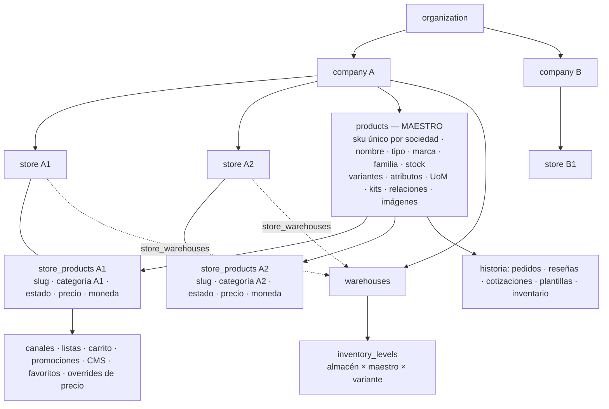

# Certificación — Stores + Product Master (fase 06)

- **Fecha:** 2026-09-17
- **Rama:** `dev` (commits locales, **sin push**)
- **Línea base (fase 01):** `712ad8e` — 238 archivos / 4 451 pruebas en verde
- **Decisiones:** [`adr/018-stores-product-master-company-scope.md`](adr/018-stores-product-master-company-scope.md)
- **Plan y trazabilidad por dependencia:** [`STORES_PRODUCT_MASTER_MIGRATION_PLAN.md`](STORES_PRODUCT_MASTER_MIGRATION_PLAN.md) (§3 grafo, §11 estado, §12–§14 implementación)
- **Evidencia automatizada principal:** [`supabase/tests/stores-product-master-certification.test.ts`](../supabase/tests/stores-product-master-certification.test.ts)

## 1. Commits del programa

| Commit | Fase | Contenido |
|---|---|---|
| `02895bd` | 01 | ADR 018, plan de migración, auditoría de SKU |
| `a393cf2` | 02 | Tiendas en autoservicio (`create_store`, `update_store`, `set_store_status`, `/app/stores`) |
| `996e1d1` | 03 | Producto maestro + `store_products` + `store_price_overrides`, relleno, modelos de lectura |
| `3eeca01` | 04 | Backoffice del maestro y publicación por tienda, importación contra el maestro |
| `7e84e7c` | 04/05 | Constante `admin_store_products` |
| `0222d54` | 05-A | Precios, listas, canales, promociones y cotizaciones sobre la publicación |
| `bfe4359` | 05-B | Carrito, pedido, inventario y API de socio sobre la publicación |
| `6ba6590` | 05-C | Búsqueda, favoritos, reseñas, B2B y KPIs sobre la publicación |
| `7f41fd3` | 05-D | Contracción |
| (este) | 06 | Test de certificación, este informe, STATE |

## 2. Migraciones nuevas (ninguna migración aplicada fue editada)

| Migración | Qué hace |
|---|---|
| `20260917100000_store_management.sql` | Comandos de tienda con tenant del JWT, inmutabilidad de org/sociedad, códigos estables |
| `20260917110000_product_master_expand.sql` | `store_products`, `store_price_overrides`, relleno 1:1 verificado, SKU por sociedad con marca de conflicto, FKs del PIM al maestro |
| `20260917120000_product_master_read_models.sql` | Vistas públicas y ATP por publicación y tienda, `admin_store_products` |
| `20260917130000_product_master_commands.sql` | `admin_product_masters`, `publish/update/unpublish_product`, `product_store_publications`, `delete_product_master`, ancla PIM |
| `20260917140000_product_master_import.sql` | Importación: SKU de sociedad, publica en la tienda destino |
| `20260917160000_product_master_pricing_promotions.sql` | Motor de precios, cotización, promociones, cotizaciones y sus FKs |
| `20260917170000_product_master_orders_inventory.sql` | Carrito, pedido, disponibilidad, inventario, API de socio y sus FKs |
| `20260917180000_product_master_storefront_b2b.sql` | Búsqueda, favoritos por tienda, reseñas, relacionados, pedido rápido, programados, sugeridos, KPIs y sus FKs |
| `20260917190000_product_master_contract.sql` | Contracción: columnas legacy en NULL como fachada, claves e índices por tienda fuera, `set null` al borrar tienda |

**Estado de despliegue:** ninguna aplicada en DEV/QAS/PRD (no hubo orden de despliegue).

## 3. Arquitectura final

- **Lo de la sociedad (maestro):** identidad, PIM, stock de catálogo, existencias por almacén.
- **Lo de la tienda (publicación):** si se vende, slug, categoría, estado, fechas, precio de catálogo,
  moneda y precios propios de variante/presentación.
- **Referencian la publicación** `(product_id, store_id)`: `product_channels`, `price_list_items`,
  `promotion_scopes`, `cart_items`, `content_block_items`, `product_favorites`, `store_price_overrides`.
- **Referencian el maestro** `(id, organization_id, company_id)`: PIM, `order_items`, `product_reviews`,
  `inventory_levels`; `quote_items`, `assortment_items`, plantillas, sugeridos y pronósticos por `id`.

## 4. Invariantes certificados

Las pruebas de la columna *Evidencia* están en `supabase/tests/`. `cert` = `stores-product-master-certification.test.ts`.

### 4.1 Casos de aceptación del encargo

| # | Caso | Resultado | Evidencia |
|---|---|---|---|
| 1 | Company A tiene tiendas A1 y A2 | PASS | `cert` › caso 1 (3 tiendas en A, sin UNIQUE por sociedad) |
| 2 | Company B tiene tienda B1 | PASS | `cert` › caso 2 (A no ve ni edita B1) |
| 3 | X de A se publica en A1 y A2, nunca en B1 | PASS | `cert` › caso 3 (mismo id; comando, RLS y FK compuesta rechazan B1) |
| 4 | X publicado solo en A1 no aparece en A2 | PASS | `cert` › caso 4 (vitrina y pedido de A2); `product-master-commands` |
| 5 | A1 y A2 con configuración comercial distinta | PASS | `cert` › caso 5 (slug, precio, categoría); `product-master-pricing` (lista, override, promoción) |
| 6 | Tienda nueva después del onboarding | PASS | `cert` › caso 6 (sin tenant nuevo); `store-management` |
| 7 | Sin permiso no crea tiendas ni por RPC directo | PASS | `cert` › caso 7 (catalog/orders/viewer → `SIN_PERMISO`, 0 filas); `store-management`; UI `stores-ui` |

### 4.2 Tiendas

| Invariante | Resultado | Evidencia |
|---|---|---|
| Ningún UNIQUE limita una sociedad a una tienda | PASS | `cert` › caso 1 (inspección de `pg_indexes`) |
| Crear tienda no crea tenant duplicado | PASS | `cert` › caso 6 |
| owner/admin crea; otros roles no | PASS | `cert` › caso 7; `store-management` |
| org/sociedad salen del JWT (sin parámetro) | PASS | `cert` (firma de `create_store`); `store-management` |
| `store_settings` 1:1 y canal por defecto | PASS | `cert` › tienda coherente |
| Tienda de A no se administra desde B ni desde otra sociedad de la misma organización | PASS | `cert` › caso 2 y «misma organización»; trigger de inmutabilidad en `store-management` |

### 4.3 Producto maestro

| Invariante | Resultado | Evidencia |
|---|---|---|
| `products` es de la sociedad (store_id opcional, solo ancla de origen) | PASS | `cert`; contracción deja columnas de publicación en NULL |
| Publicación única por `(product_id, store_id)` | PASS | `cert` (constraint `store_products_publication_key`) |
| Mismo `product_id` en dos tiendas de la sociedad | PASS | `cert` › caso 3; `product-master` |
| No se publica el maestro de otra sociedad | PASS | `cert` › caso 3; `product-master-commands` |
| slug/categoría/estado por tienda | PASS | `cert` › caso 5 y D; `product-master-commands` (categoría de otra tienda rechazada) |
| El PIM no se duplica por tienda | PASS | `cert` (FKs del PIM solo al maestro); `product-master-commands` (variante anclada, publicar no copia) |
| El modelo público nunca expone un maestro no publicado | PASS | `cert`; `product-master` (fecha futura, tienda suspendida) |

### 4.4 Comercio

| Invariante | Resultado | Evidencia |
|---|---|---|
| Precio server-authoritative | PASS | `cert` (el pedido cobra 120.00 aunque el navegador mande 0.01); `product-master-pricing`; `pricing-checkout` |
| Inventario no manipulable desde el navegador | PASS | `cert` (sin GRANT de escritura en `inventory_levels`); `inventory` |
| Carrito/pedido validan contra la tienda correcta | PASS | `product-master-orders` (pedido de A1 rechaza lo solo publicado en A2; FK de `cart_items`) |
| Históricos sobreviven a despublicar | PASS | `cert`; `product-master-orders`; `product-master-storefront` (reseñas) |
| Promociones, CMS y pedido rápido no cruzan tiendas | PASS | `cert` (pedido rápido y promoción); `product-master-pricing`; `product-master-storefront`; FK de `content_block_items` |
| Stock físico no se duplica al publicar en dos tiendas | PASS | `product-master-orders` (un nivel, mismo ATP en A1 y A2) |
| Aislamiento entre tenants | PASS | `cert` › D fuga; `rls-tenant-isolation`; `product-master` RLS |

## 5. Migración legacy

| Comprobación | Resultado | Evidencia |
|---|---|---|
| Productos antes/después | 3 → 3 (fixture legacy de `cert`); DEV auditado en fase 01: 780 productos, 0 conflictos | `cert` › B; plan §4 |
| IDs mutados | 0 | `cert` › B (ids idénticos) |
| Productos perdidos | 0 | `cert` › B |
| Cada producto legacy con su publicación inicial | Sí (slug, precio, tienda) | `cert` › B; verificación `RELLENO_INCONSISTENTE` dentro de la migración; `product-master` |
| Conflictos SKU legacy | Conservados y marcados `legacy_sku_conflict`, sin fusionar; otra sociedad no cuenta | `cert` › B; `product-master` |
| FKs huérfanas / no validadas | 0 | `cert` › B (`pg_constraint.convalidated`); guardas `PUBLICACION_FALTANTE` y `CONTRACCION_INCONSISTENTE` en migraciones |
| Datos de publicación residuales en el maestro | 0 filas | `cert` › B |

## 6. Gates ejecutados

| Comando | Resultado |
|---|---|
| `npm run typecheck` | PASS |
| `npm run lint` | PASS |
| `npm run test` | PASS — 246 archivos, 4 571 pruebas, 0 fallos (línea base: 238 archivos, 4 451 pruebas) |
| `npm run test:db` | PASS — 109 archivos, 2 691 pruebas, 0 fallos |
| `npm run build` | PASS (aviso habitual de chunks > 400 kB, preexistente) |
| `npm run scan:secrets` | PASS — sin hallazgos |
| `npm run check:edge` | PASS — 67 archivos sin errores |
| `npm run bundle:report` | PASS — los 4 recorridos dentro del techo (portada 403.4 kB de 405) |

**PREEXISTING vs INTRODUCED:** la línea base de fase 01 estaba en verde; no quedan fallos. Los tests
que cambiaron lo hicieron porque leían columnas que por diseño dejaron de guardar datos (ver plan §14);
ninguno se borró ni se debilitó.

**No ejecutado:**
- Reset de un Supabase local: no hay stack local levantado; las migraciones completas se prueban
  desde cero en cada archivo de PGlite (cada test crea una base vacía y aplica las 187 migraciones).
- Playwright golden path: requiere el stack local con estas migraciones aplicadas; queda para QAS.

## 7. Compatibilidad temporal restante (deuda con criterio de retirada)

| Pieza | Motivo | Retirada |
|---|---|---|
| `product_variants.price/compare_at_price`, `product_uoms.price` sincronizados con `store_price_overrides` de la tienda de origen | los paneles PIM y la importación escriben ahí; ningún lector de comercio los usa | cuando los paneles editen overrides por tienda |
| Columnas de publicación de `products` (siempre NULL) como fachada de escritura | seed, fixtures, importación, Edge Function antigua | cuando no quede escritor legacy |
| `products.store_id` y `store_id` del PIM | ancla de origen de la fachada y de la sincronía de precios | con la anterior |
| `inventory_levels.store_id` NOT NULL + FK de tienda `cascade` | `inventory_movements.store_id` NOT NULL lo copia | cuando movimientos acepten ancla nula |
| `product_variants_barcode_key (store_id, barcode)` | unificarlo por sociedad podría chocar con datos heredados | tras auditar códigos de barras |
| `admin_products` (vista de compatibilidad) | la usa `catalog-copy` | al migrar `catalog-copy` a `admin_product_masters` |

## 8. Riesgos

| Nivel | Riesgo | Estado / mitigación |
|---|---|---|
| P0 | Fuga cross-tenant | Sin hallazgos: FKs compuestas, RLS, comandos INVOKER con tenant del JWT; `cert` › D, `rls-tenant-isolation` |
| P0 | Pérdida o mutación de datos legacy al migrar | Sin hallazgos: relleno verificado dentro de la migración, guardas en la contracción; `cert` › B |
| P1 | Conflictos SKU reales en QAS/PRD | Mitigado: índice parcial + marca + trigger; ejecutar `scripts/audit/product-sku-conflicts.sql` antes de aplicar |
| P1 | Filas sin publicación en QAS/PRD al mover FKs | Mitigado: las migraciones abortan con `PUBLICACION_FALTANTE`/`CONTRACCION_INCONSISTENTE` en vez de dejar datos a medias |
| P1 | Cambio de semántica: precio propio de variante pasa a ser por tienda | Esperado por ADR 018; comunicar a quienes tenían el mismo producto en varias tiendas (hoy no ocurre: cada producto legacy tenía una sola tienda) |
| P2 | Deuda de fachada y sincronía de precios de variante | §7 |
| P2 | Rendimiento: un JOIN más en vistas y búsqueda; `fetchPricingCatalog` carga variantes de la sociedad | índices de `store_products`; revisar en QAS con catálogo grande |
| P2 | Favoritos: clientes antiguos sin `p_store_id` | respaldo determinista (tienda de origen o primera publicada activa) |

No quedan P0/P1 **introducidos** abiertos.

## 9. Conclusión

**Lista para QAS**, condicionada a: (1) ejecutar la auditoría de SKU en la base destino, (2) aplicar
las 9 migraciones en orden en QAS, (3) correr el golden path de Playwright contra ese entorno. Nada
se aplicó a DEV, QAS ni PRD; no hubo push.
