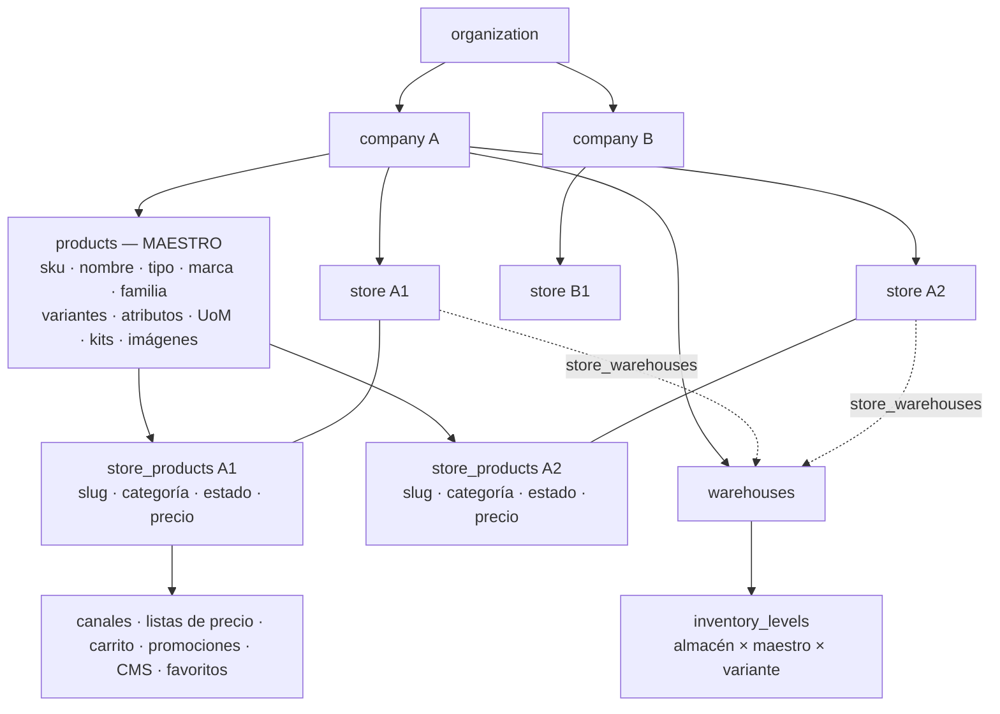

# ADR 018 — N tiendas por sociedad y producto maestro de sociedad con publicación por tienda

- **Fecha**: 2026-09-16
- **Fase**: Stores + Product Master (fases 01–06, `_EBIM_PROMPTS/prompts`)
- **Estado**: aceptado
- **Contexto normativo**: contrato EBIM §3 (organización → sociedad → datos con `organization_id` +
  `company_id` en cada fila; RLS por claims), `CLAUDE.md` (tenant siempre del JWT, RLS default deny,
  `SECURITY DEFINER` solo con autorización explícita), ADR 003 (PIM), ADR 004 (motor de precios),
  ADR 006 (inventario).

---

## Contexto

El esquema ya admitía varias tiendas por sociedad (`stores` no tiene unicidad por sociedad, el seed
tiene dos, `StoreSwitcher` pinta un menú), pero **nada permitía crear la segunda**: la única función
que inserta una tienda es `bootstrap_tenant`, que falla con `TENANT_YA_EXISTE` si la organización
existe.

El catálogo, en cambio, nació con **un producto por tienda**: `products.store_id NOT NULL`, SKU y slug
únicos por tienda, y **quince claves ajenas `(product_id, store_id) → products (id, store_id)`**. El
inventario de la fase 01 (documentado en `docs/STORES_PRODUCT_MASTER_MIGRATION_PLAN.md`) midió sobre el
esquema efectivo: 38 claves ajenas hacia `products`/`product_variants`, 5 vistas y 40 funciones que
leen `products`, 34 archivos de frontend, 5 Edge Functions.

Vender el mismo artículo en dos tiendas obliga hoy a duplicarlo: dos SKU iguales, dos juegos de
variantes, dos fichas que divergen y dos historiales de venta que no se pueden sumar.

## Decisiones

### Tiendas

1. **Una organización tiene N sociedades y cada sociedad N tiendas.** Ni la base ni la aplicación
   limitan la cantidad. El hub no declara hoy un límite de tiendas por plan; si lo declara, entra como
   entitlement leído del Platform Context, **nunca como un número local**.
2. **Las tiendas son autoservicio para owner/admin de la sociedad activa** (permiso `store.manage`).
   `catalog`, `orders`, `viewer` y `sales_rep` no crean ni administran tiendas, y lo impide el
   servidor, no el botón.
3. **Alta con un comando propio, `public.create_store`**, separado del onboarding. Deriva
   `organization_id` de `ebim.org_id()` y `company_id` de `ebim.active_company()`; no acepta ninguno
   de los dos. Crea tienda + `store_settings` en la misma transacción; el canal B2C por defecto lo sigue
   creando el trigger `stores_default_channel`. **Nace `draft`**: una tienda vacía no se publica sola.
   `bootstrap_tenant` no cambia y sigue siendo el alta del tenant.
4. **Una tienda no cambia de organización ni de sociedad**: trigger de inmutabilidad, además de las
   policies. La edición (nombre, slug, dominio) y el estado (`draft`/`active`/`suspended`) van por
   comandos con código de error estable. **No hay borrado autoservicio**: una tienda con pedidos,
   cobros y asientos de inventario no se borra; se suspende.

### Producto maestro

5. **`products` pasa a ser el MAESTRO de la sociedad** y **`products.id` se conserva** como su
   identidad. Es de la sociedad (`organization_id` + `company_id`), no de la organización: dos
   sociedades nunca comparten productos.
6. **La publicación es una relación explícita, `public.store_products`**, con unicidad
   `(store_id, product_id)`. Es la frontera de todo lo que significa «este producto se ve o se vende en
   esta tienda»: slug, categoría, estado, fecha de publicación y precio de catálogo.
7. **Las categorías siguen siendo de la tienda.** La categoría de una publicación solo puede ser de su
   tienda, y lo impide una clave ajena `(category_id, store_id)`.
8. **El precio es contexto comercial, no identidad.** El precio de catálogo (`price`,
   `compare_at_price`, `currency`) vive en la publicación, en la moneda de la tienda. Los precios
   propios de variante y de presentación, que hoy son importes absolutos, pasan a
   `public.store_price_overrides`, también por tienda: una variante de S/ 199 no puede salir a 199 USD
   en otra tienda de la misma sociedad. **El motor no cambia de forma**: `ebim.resolve_prices` sigue
   siendo la única autoridad y solo cambia de dónde lee el precio base. No se crea un segundo motor ni
   un precio global.
9. **El inventario no se duplica.** La existencia física sigue siendo `warehouse × producto maestro ×
   variante`; una tienda vende contra los almacenes que la sirven (`ebim.serving_warehouses`). El
   `store_id` de `inventory_levels` deja de filtrar disponibilidad. `products.stock` sigue siendo el
   camino de fallback sin almacenes (ADR 006) y queda a nivel de maestro: dos tiendas sin almacenes
   venden contra el mismo stock de catálogo, que es la misma mercancía.
10. **El PIM es del maestro**: variantes, valores de atributo, presentaciones, kits, relaciones e
    imágenes. Sus claves ajenas pasan a `(product_id, organization_id, company_id)`. Publicar en la
    tienda B no copia ni una variante.
11. **El SKU es único por sociedad**, compartido entre productos y variantes (la regla que hoy es por
    tienda). **No se deduplica nada por heurística**: si una base tiene el mismo SKU en dos tiendas de
    una sociedad, esas filas se marcan (`legacy_sku_conflict`) y se conservan; la unicidad se impone a
    todo lo demás y a toda fila nueva. La auditoría portable está en
    `scripts/audit/product-sku-conflicts.sql`; en DEV (2026-09-16) devolvió **cero** conflictos.
12. **Toda tabla que dice «producto vendido o mostrado en esta tienda» referencia la publicación**
    `(product_id, store_id) → store_products`: canales, renglones de lista de precios, carrito,
    alcances de promoción, bloques del CMS y favoritos. Lo que es **historia** referencia el maestro y
    valida la publicación al escribir: renglones de pedido, reseñas, cotizaciones, plantillas y
    sugeridos. Despublicar no borra historia.

### Transición

13. **Expand → migrate → switch → contract.** Se crea la publicación, se rellena una por cada producto
    legacy en su tienda actual, se cambian los lectores y al final se retiran las restricciones por
    tienda. Ninguna operación destructiva única.
14. **Las columnas legacy de publicación en `products`** (`slug`, `category_id`, `status`,
    `published_at`, `price`, `compare_at_price`, `currency`) y los precios propios de
    `product_variants`/`product_uoms` **quedan como fachada de escritura durante la transición**: lo
    que se escribe en ellas se traslada a la publicación (o al precio propio) de la tienda de origen.
    Mientras los lectores legacy de comercio no se migran (fases 03–04), la tienda de origen se
    mantiene **sincronizada en los dos sentidos** con su publicación —dejarlas en `NULL` antes habría
    roto medio centenar de funciones a la vez—. En la contracción de la fase 05 la sincronía inversa
    se retira y la columna pasa a quedar en `NULL`, de modo que **nadie pueda leer un dato viejo
    creyendo que es el vigente**; los clientes y fixtures que aún escriben la forma antigua siguen
    funcionando. `products.store_id`
    pasa a significar «tienda de origen» y deja de ser obligatorio. Su retirada física es la migración
    de contracción, condicionada a que no quede ningún escritor (ver plan §9).
15. **Las imágenes no se mueven en Storage.** La fila de `product_images` pasa a ser del maestro; el
    objeto físico conserva su ruta `{org}/{store}/{product}/…`, y la tienda de la ruta solo indica
    dónde se subió (debe ser de la misma sociedad). La lectura anónima exige que el producto esté
    publicado en alguna tienda activa.

## Diagrama

## Alternativas descartadas

- **Duplicar el producto por tienda y enlazarlos con un «grupo».** Mantiene la duplicación que este ADR
  existe para quitar: dos SKU, dos juegos de variantes, dos fichas que divergen.
- **Borrar `products.store_id` en una migración.** Rompe a la vez 38 claves ajenas, 40 funciones y
  5 vistas, sin forma de desplegar sin caída.
- **Precio único en el maestro.** Deja de ser cierto en cuanto dos tiendas tienen distinta moneda o
  distinta tarifa de catálogo, y el negocio ya distingue minorista, mayorista y B2B.
- **Inventario por tienda.** Duplicaría la existencia física de un almacén que sirve a dos tiendas y
  rompería el CHECK de no sobreventa, que solo tiene sentido sobre un único saldo.
- **Mantener las columnas legacy sincronizadas en los dos sentidos.** Un espejo del «origen» parece
  vigente y miente en cuanto el producto se publica en otra tienda.
- **Fusionar SKU iguales al migrar.** Dos filas con el mismo SKU pueden ser artículos distintos con
  historias distintas; decidirlo por un texto destruye información.

## Consecuencias

- Una tienda nueva vende un producto existente con **una fila** de `store_products`, sin copiar
  variantes, imágenes ni atributos.
- El backoffice lista un producto una vez aunque esté en varias tiendas, y edita la publicación de cada
  tienda por separado.
- Toda función de vitrina, carrito, pedido, promoción, CMS, pedido rápido o API que hoy filtra
  `products.store_id` tiene que pasar por la publicación. El plan de migración enumera cada una.
- Queda deuda explícita y fechada: la fachada de escritura legacy y el `store_id` de origen en las
  tablas PIM, con su criterio de retirada.
